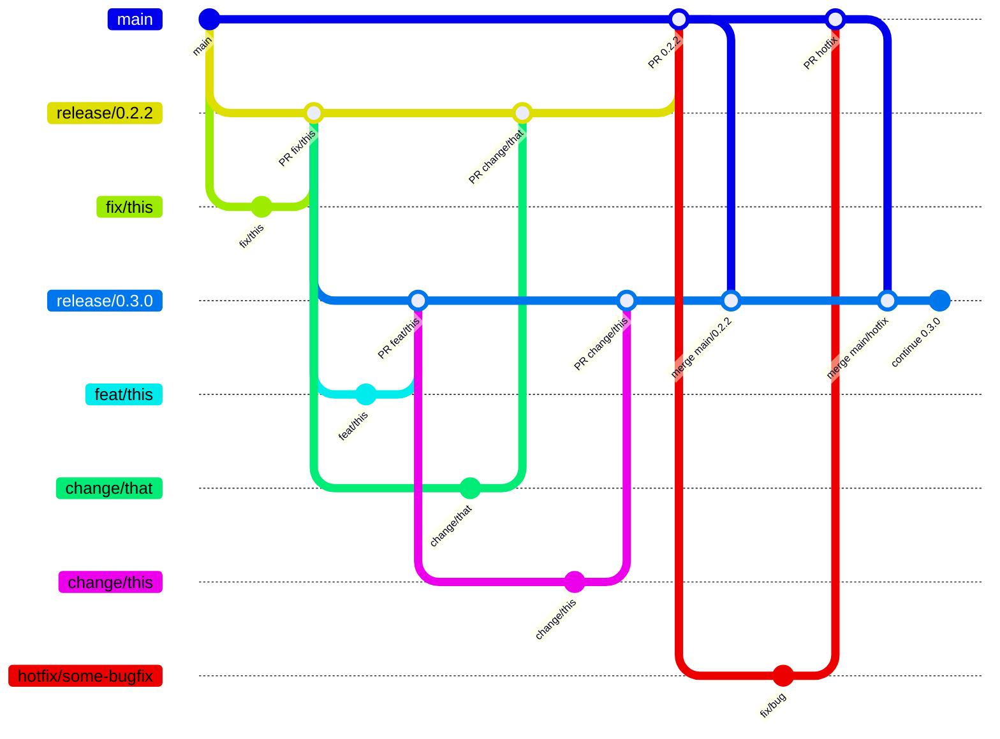

# Branching and Release Workflow

- Direct commits and direct pushes to `main` and `release/*` branches are not allowed. All changes must be made via pull requests.
- All release branches must be named `release/x.y.z` (e.g., `release/0.2.2`, `release/0.3.0`) to match the branch protection and CI rules.
- **All changes to release branches must be made via feature, fix, or change branches (e.g., `feat/feature-name`, `fix/bug-description`, `change/description`) created from the relevant release branch, and merged back via pull requests.**
- Hotfix branches (e.g., `hotfix/bug-description`) should be created from `main` and merged back into `main` via pull request, then merged into active release branches as needed.
- Changes merged via pull requests to `main` and `release/*` branches trigger CI workflows. Pull requests require review and conversation resolution before merging, as enforced by branch protection rules.
- When a release branch is finalized, merge it into the next release branch to propagate fixes and changes.
- After a release is finalized, merge it into `main` to keep the main branch up to date.
- **In the diagram below, all merges labeled "PR ..." represent pull request merges.**

> **Note:** If the diagram below does not render, refer to the bullet list above for a summary of the workflow.



# Release Checklist for dcmspec

> **Note:** This checklist is intended for project maintainers and developers.
> It is not required for users of the dcmspec library.

1. [ ] Update `pyproject.toml` with the new version number.
2. [ ] Add a new section to `CHANGELOG.md` for the release:

   - Use the format:

   ```text
   ## [x.y.z] - YYYY-MM-DD

   ### Added
   - Support for ... ([#NN](https://github.com/dwikler/dcmspec/issues/NN))

   ### Changed
   - Improved ... ([#NN](https://github.com/dwikler/dcmspec/issues/NN))

   ### Fixed
   - Corrected ... ([#NN](https://github.com/dwikler/dcmspec/issues/NN))
   ```

- Use **"Added"** for new features, **"Changed"** for enhancements or improvements, and **"Fixed"** for bug fixes.

3. [ ] Commit the changes:

   ```bash
   git add pyproject.toml CHANGELOG.md docs/changelog.md
   git commit -m "Bump version to x.y.z and update CHANGELOG"
   ```

4. [ ] Tag the release:

   Choose the appropriate command below based on the main type of change in this release.

   For a new feature:

   ```bash
   git tag -a vX.Y.Z -m "Add support for ... (#NN)"
   ```

   For an enhancement:

   ```bash
   git tag -a vX.Y.Z -m "Improve ... (#NN)"
   ```

   For a bug fix:

   ```bash
   git tag -a vX.Y.Z -m "Corrected ... (#NN)"
   ```

5. [ ] Push commits and tags:

   ```bash
   git push
   git push --tags
   ```

6. [ ] Create a GitHub Release for the new tag:

   - Copy the changelog entry into the release notes.

7. [ ] [Build and test the distribution locally before publishing](#how-to-test-the-distribution-before-publishing)

8. [ ] Publish to PyPI:

   ```bash
   poetry publish --build
   ```

---

## How to Move the Tag

If you forgot to update a file (like `pyproject.toml` or `changelog.md`) before tagging, you can move the tag to the correct commit after making the necessary changes:

Use these steps only if you need to update the tag after making additional changes.

1. Make and commit the missing changes.

2. Delete the old tag locally:

   ```bash
   git tag -d vX.Y.Z
   ```

3. Re-create the tag on the latest commit:

   ```bash
   git tag -a vX.Y.Z -m "Your release message"
   ```

4. Force-push the updated tag to GitHub:

   ```bash
   git push --force origin vX.Y.Z
   ```

**Note:** Only force-push tags if you are sure no one else is relying on the old tag, or coordinate with your team if you are working with others.

---

## How to Test the Distribution Before Publishing

1. Build the package:

   ```bash
   poetry build
   ```

2. Inspect the contents of the built distributions:

   - For the source distribution:

     ```bash
     tar -tzf dist/dcmspec-x.y.z.tar.gz
     ```

   - For the wheel:

     ```bash
     unzip -l dist/dcmspec-x.y.z-py3-none-any.whl
     ```

   - Check that all expected files (code, README, LICENSE, CHANGELOG, etc.) are present, and that nothing unwanted (like tests or scratch files) is included.

3. Test installation in a clean virtual environment:

   ```bash
   python -m venv /tmp/testenv
   source /tmp/testenv/bin/activate
   pip install "dist/dcmspec-x.y.z-py3-none-any.whl[gui,pdf]"
   ```

4. Test CLI and GUI:

   - Run a CLI command:

     ```bash
     iodattributes --help
     ```

   - Run the GUI (if applicable):

     ```bash
     iod-explorer
     ```

5. (Optional) Test upload to TestPyPI:

   ```bash
   poetry publish --repository testpypi
   ```

   - Then try installing from TestPyPI:

   ```bash
   pip install --index-url https://test.pypi.org/simple/ --extra-index-url https://pypi.org/simple/ dcmspec
   ```

   Note: If you want to test optional dependencies (like GUI or PDF support), include the extras:

   ```bash
   pip install --index-url https://test.pypi.org/simple/ --extra-index-url https://pypi.org/simple/ "dcmspec[gui,pdf]"
   ```

6. Deactivate and remove the test environment when done:
   ```bash
   deactivate
   rm -rf /tmp/testenv
   ```

This process helps ensure your package is complete, installs cleanly, and works as expected before you publish to PyPI.

---

## Poetry TestPyPI Configuration (for maintainers)

### How to get a TestPyPI token

- Go to https://test.pypi.org/manage/account/#api-tokens (2FA required).
- Click "Add API token".
- Give your token a name and (optionally) restrict it to your project.
- Copy the generated token and save it in a secure place (you will not be able to see it again).

The token is used as the "password" with username `__token__` (Poetry handles this automatically).

### How to configure Poetry for TestPyPI

First, always configure the TestPyPI repository:

```bash
poetry config repositories.testpypi https://test.pypi.org/legacy/
```

Then, choose one of the following authentication methods:

- Persist the token (less secure, but convenient for local use):

  ```bash
  poetry config pypi-token.testpypi <your-testpypi-token>
  ```

- Or, for ephemeral use (recommended), set the token as an environment variable:

  ```bash
  export POETRY_PYPI_TOKEN_TESTPYPI=<your-testpypi-token>
  ```

- Or for CI/CD, set the token as a secret environment variable

  In **GitHub Actions** (or other CI/CD systems), set this as a secret environment variable in your pipeline configuration:

  1.  Go to your repository on GitHub → **Settings** → **Secrets and variables** → **Actions** → **New repository secret**
  2.  Name it: `TESTPYPI_TOKEN`
  3.  Paste your TestPyPI token as the value.

  Then, in your workflow YAML, add:

  ```yaml
  env:
    POETRY_PYPI_TOKEN_TESTPYPI: ${{ secrets.TESTPYPI_TOKEN }}
  ```

  Example GitHub Actions workflow:

  ```yaml
  jobs:
  publish-testpypi:
     runs-on: ubuntu-latest
     env:
        POETRY_PYPI_TOKEN_TESTPYPI: ${{ secrets.TESTPYPI_TOKEN }}
     steps:
        - uses: actions/checkout@v4
        - name: Set up Python
        uses: actions/setup-python@v5
        with:
           python-version: '3.12'
        - name: Install Poetry
        run: pip install poetry
        - name: Build and publish to TestPyPI
        run: |
           poetry config repositories.testpypi https://test.pypi.org/legacy/
           poetry publish --build --repository testpypi
  ```
