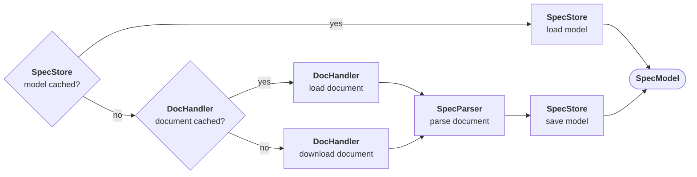
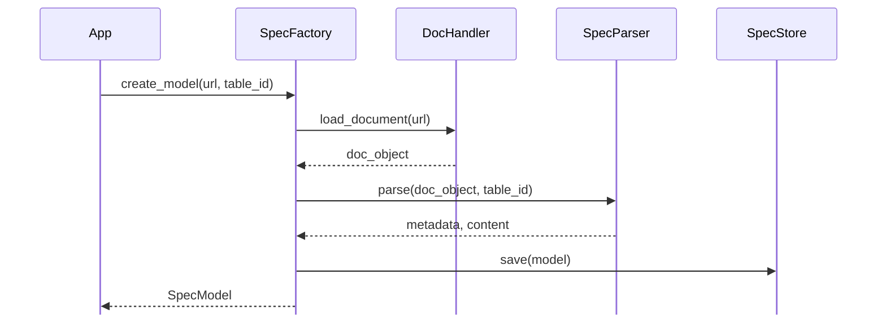
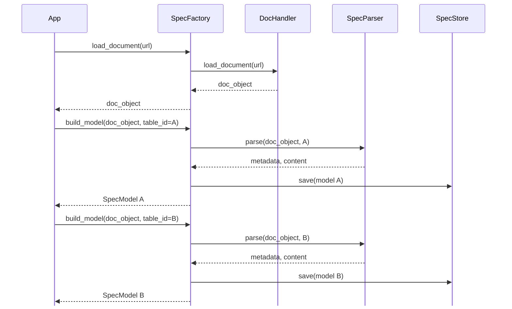

# API Overview

This section documents the main modules and classes provided by **dcmspec**.

The API enables extraction, parsing, and processing of DICOM specification tables and related data from the DICOM standard and IHE documents for use in Python projects. Each class's page is listed in the sidebar, grouped by functional area.

## The building blocks

- **Document handlers** download and cache the raw specification document (or load it from
  cache), producing an in-memory document object. ( Base class: [`DocHandler`](doc_handler.md))

    - [`SectionImageResolver`](section_image_resolver.md) uses a `DocHandler` to download and
      cache the images a resolved section references.

- **Parsers** parse that document object into a metadata node and a content node.
  ( Base class: [`SpecParser`](spec_parser.md))
- **Storers** save a built `SpecModel` to disk and load it back on request.
  ( Base class: [`SpecStore`](spec_store.md))
- **Models** wrap the resulting metadata and content nodes and provide the query/manipulation
  API. ( Base class: [`SpecModel`](spec_model.md))

## The factory

- **Factories** orchestrate the production pipeline of a `SpecModel` using a `DocHandler`, a `SpecParser`, and a `SpecStore`
  and checking for cached models and documents along the way.
  ( Class: [`SpecFactory`](spec_factory.md))



## Two ways to use SpecFactory

### One call

- `create_model()` downloads (or reuses the cache), parses, builds, and caches a model in a single
call.

Use it whenever an application needs a single model from a single document.



```python
from dcmspec.spec_factory import SpecFactory

factory = SpecFactory(...)
model = factory.create_model(url=..., cache_file_name=..., table_id=...)
```

### Split call

- `load_document()` downloads/caches and parses only the raw document object, without building a
model.
- `build_model()` then takes that document object and builds (and caches) one `SpecModel`
from it.

Use this when an application needs several models built from the same document, as
it avoids downloading it again for each one.



```python
from dcmspec.spec_factory import SpecFactory

factory = SpecFactory(...)
doc = factory.load_document(url=..., cache_file_name=...)
model_a = factory.build_model(doc, table_id="table_a", json_file_name="a.json")
model_b = factory.build_model(doc, table_id="table_b", json_file_name="b.json")
```

## The builders

- **Builders** orchestrate the composition of specific DICOM models such as IODs or Modules,
  using `SpecFactory`'s split-call pattern to build them from several `SpecModel`s.

    - [`IODSpecBuilder`](iod_spec_builder.md) merges all Modules into one IOD.
    - [`ModuleSpecBuilder`](module_spec_builder.md) keeps Attribute table and Attribute
      Description sections separate.

## The registries

- **Registries** list already-built `SpecModel`s, so builders reuse them
  instead of loading or building them again.
  ( Classes: [`ModuleRegistry`](module_registry.md), [`SectionRegistry`](section_registry.md))

## The mergers

- **Mergers** merge two already-built `SpecModel`s by matching node path or node, e.g. enriching a
  Part 3 module attributes table with VR, VM, Keyword, or Status from the Part 6 data elements
  dictionary. ( Class: [`SpecMerger`](spec_merger.md))

## The printers

- **Printers** render a built `SpecModel` as a table, tree, CSV, or XLSX file, optionally
  colorized in the terminal or written to a file. ( Base class: [`SpecPrinter`](spec_printer.md))